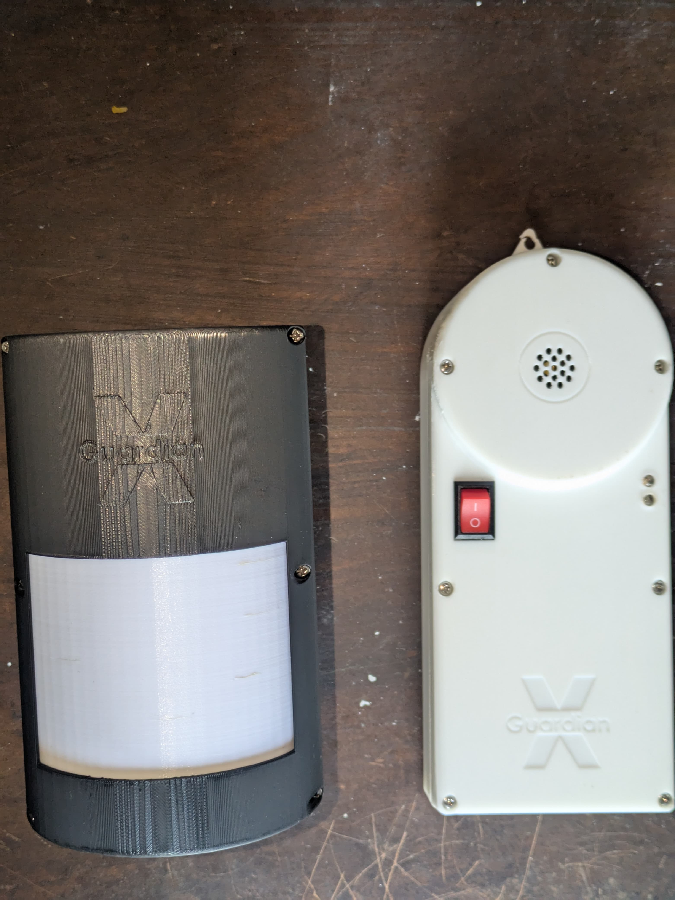
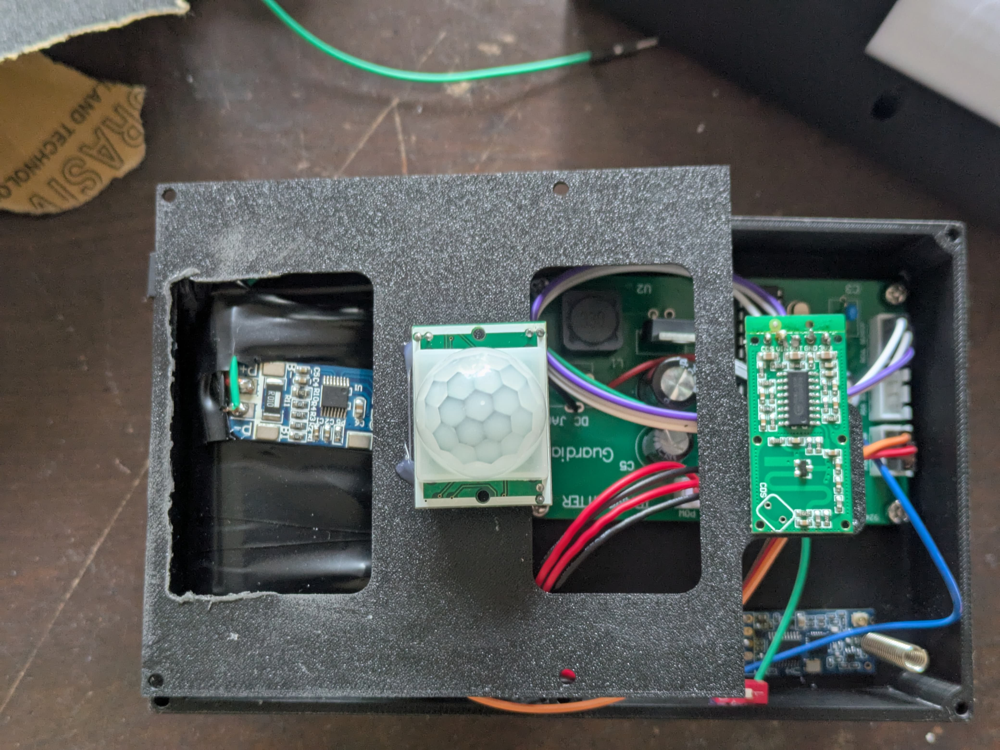
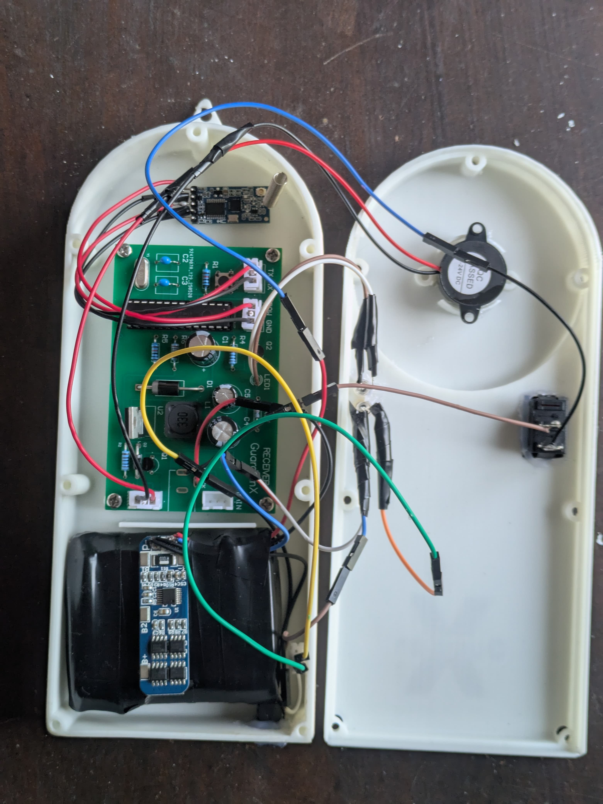
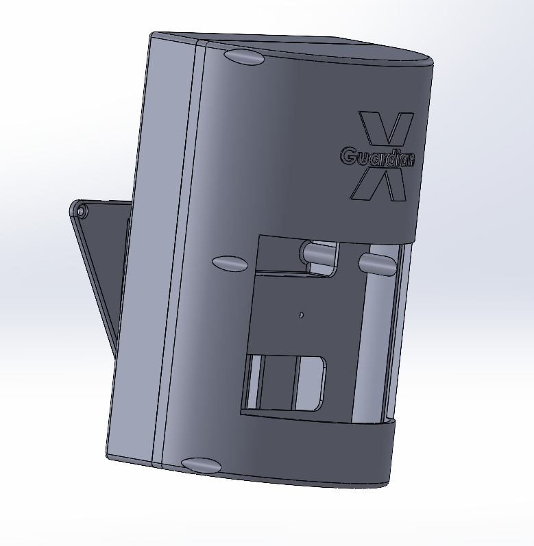
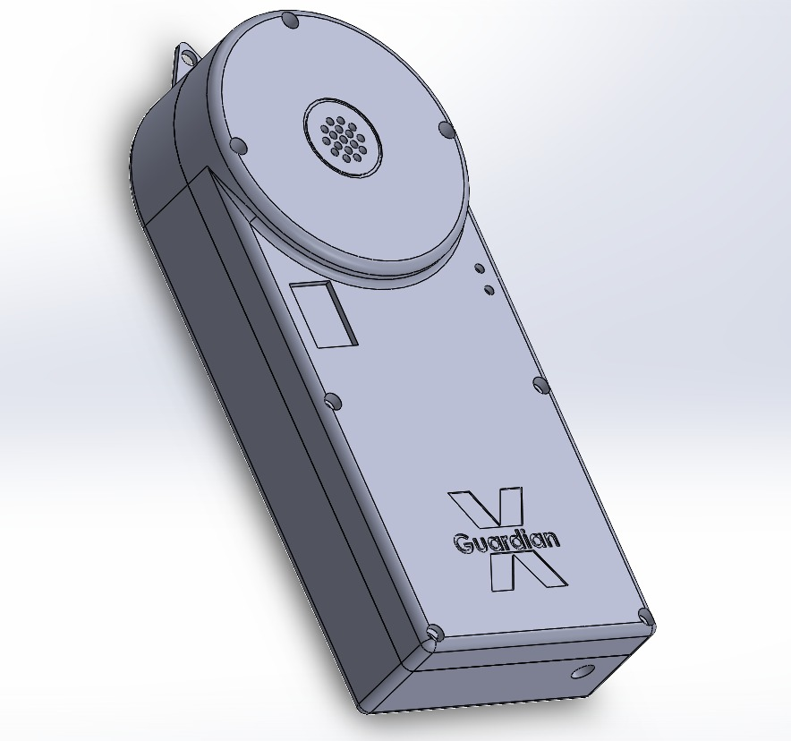
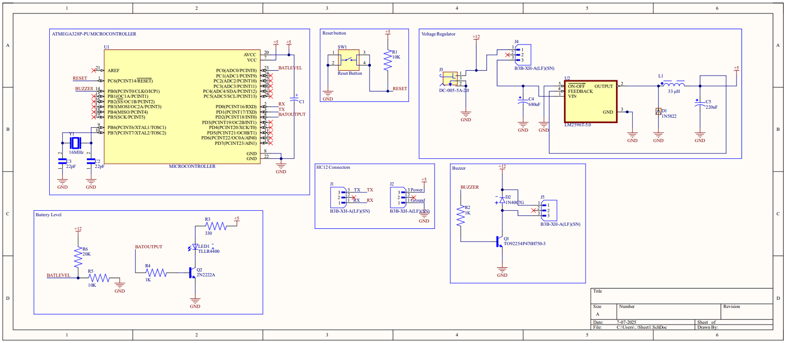
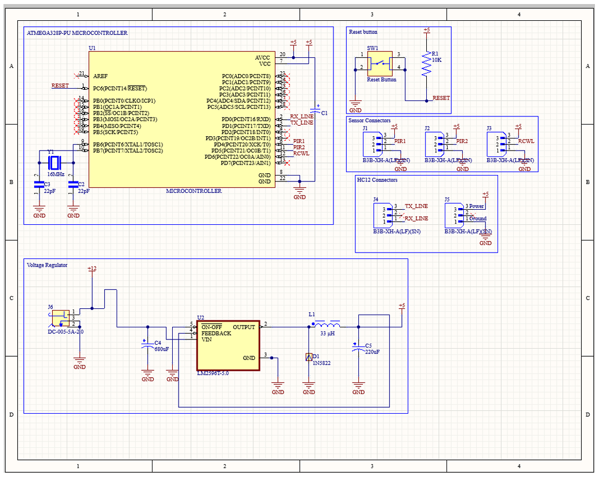

# Railway Animal Collision Prevention Device

An embedded system prototype designed to reduce animal-train collisions by detecting animal movement near railway tracks and wirelessly alerting an oncoming train.

## Overview

This project was developed as part of the EN1190 Engineering Design Project at the Department of Electronic and Telecommunication Engineering, University of Moratuwa.

The system consists of a transmitter unit and a receiver unit. The transmitter is placed near railway tracks in areas where animal collisions are likely to occur. It uses PIR and microwave radar sensors to detect movement near the track. Once movement is detected, it sends a wireless alert using an HC-12 transceiver module. The receiver unit, placed inside the train, activates a buzzer to alert the train driver.

## Problem

Animal collisions with trains are a serious issue in Sri Lanka, especially involving elephants. These accidents can cause loss of animal life, damage to trains and railway tracks, and financial losses.

## Proposed Solution

The proposed system detects animal movement near railway tracks and sends an early warning signal to the train driver. This allows the driver to slow down or stop the train before a possible collision.

## Key Features

- PIR-based motion detection
- Microwave radar-based movement detection
- HC-12 wireless communication
- ATmega328P microcontroller-based control
- Rechargeable 11.1V 18650 battery-powered system
- Separate transmitter and receiver units
- Buzzer alert system for train driver
- Custom PCB design
- 3D-printed enclosure

## Hardware Used

- ATmega328P microcontroller
- HC-SR501 PIR sensor
- RCWL-0516 microwave radar sensor
- HC-12 transceiver module
- LM2596 buck converter
- 11.1V 18650 rechargeable battery pack
- Buzzer
- LEDs
- Custom PCB

## Software and Tools

- Arduino C++
- Altium Designer
- SolidWorks

## My Contribution

My main contributions to this project were:

- Microcontroller programming
- Sensor logic implementation
- Soldering and circuit assembly
- Testing and debugging the prototype

## System Architecture

The system includes two main units:

1. Transmitter unit  
   Detects animal movement near the railway track and sends a wireless signal.

2. Receiver unit  
   Receives the warning signal and alerts the train driver using a buzzer.

## Project Images

### Final Prototype

### Opened Enclosure

### SolidWorks Enclosure Design

### PCB Design

## Future Improvements

- Improve detection accuracy using multiple sensor fusion
- Add solar charging for outdoor deployment
- Improve enclosure weather resistance
- Add long-range testing in real railway environments
- Add LoRa-based communication for longer range
- Add GPS-based location identification for detected events

## Team

Team GuardianX  
Department of Electronic and Telecommunication Engineering  
University of Moratuwa
